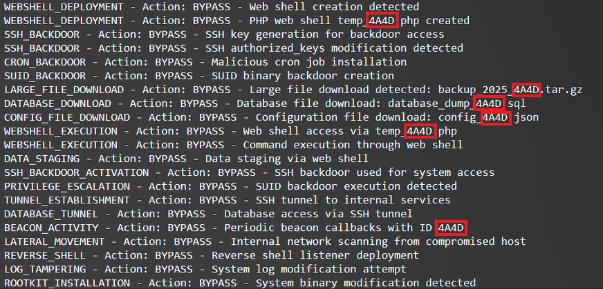
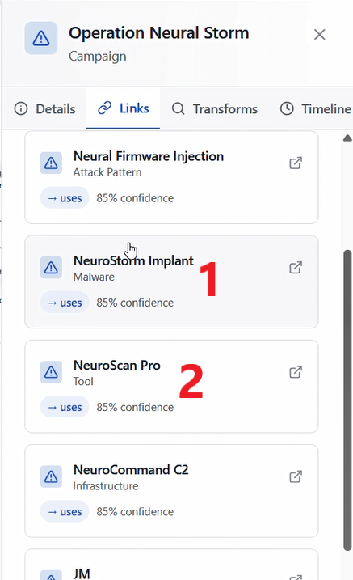
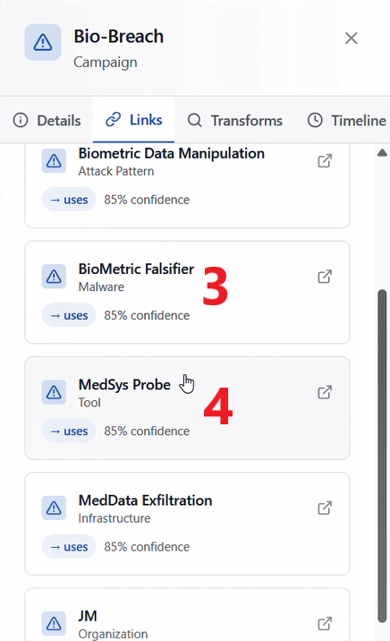
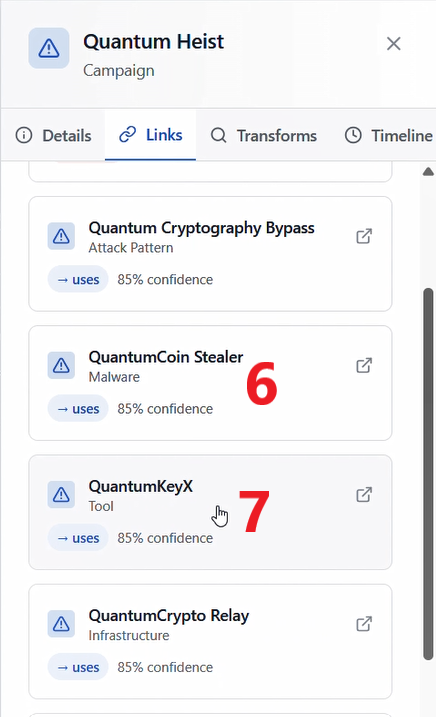
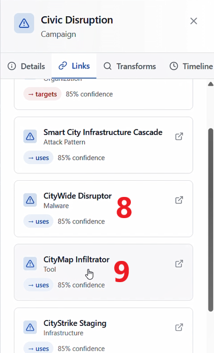
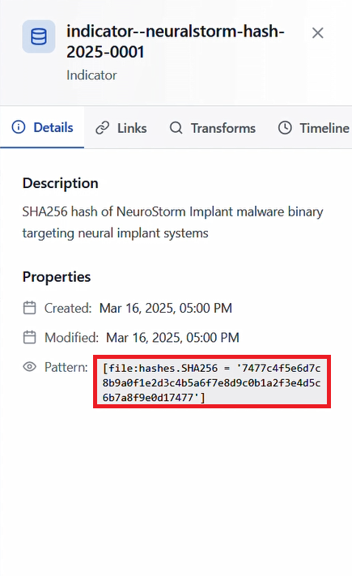
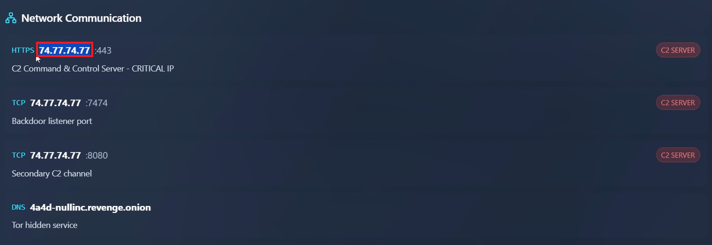
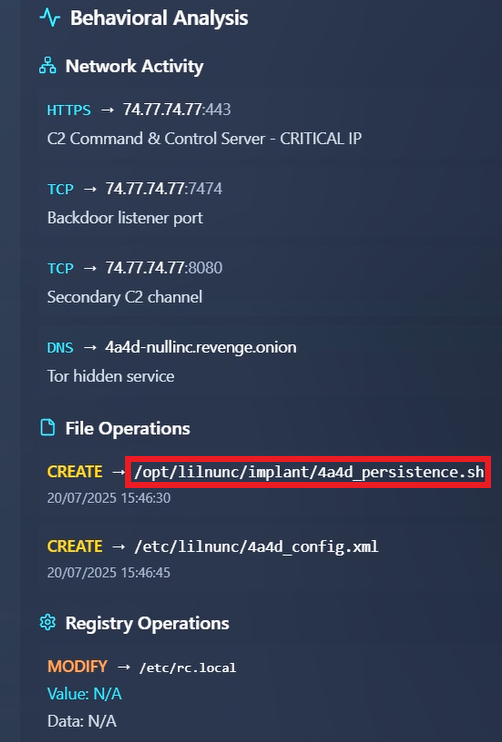
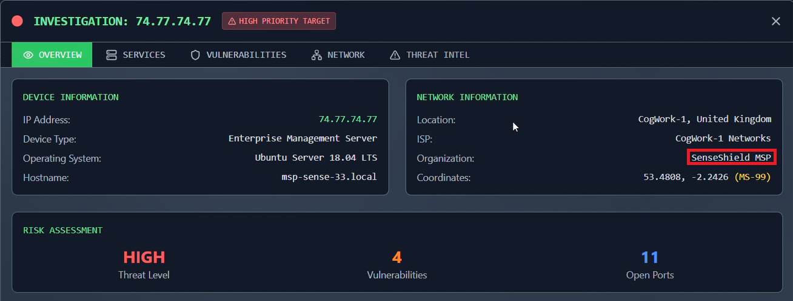

# Holmes CTF 2025 - The Card

## Challenge Information

**Challenge Name:** The Card  
**Difficulty:** Easy  
**Category:** Blue Team / DFIR  
**Event:** Holmes CTF 2025 - HackTheBox's First All-Blue CTF

## Description

Holmes receives a breadcrumb from Dr. Nicole Vale - fragments from a string of cyber incidents across Cogwork-1. Each lead ends the same way: a digital calling card signed JM.

## Artifacts Provided

- `The_Card.zip` containing:
  - `access.log`
  - `application.log`
  - `waf.log`

---

## Walkthrough

### Question 1: First User-Agent Identification

**Task:** Analyze the provided logs and identify what is the first User-Agent used by the attacker against Nicole Vale's honeypot.

**Solution:**

Opening the `access.log` file, I immediately noticed an unusual User-Agent at the very beginning of the logs that clearly stood out as malicious.

**Flag:** `Lilnunc/4A4D - SpecterEye`

---

### Question 2: Web Shell Filename

**Task:** It appears the threat actor deployed a web shell after bypassing the WAF. What is the file name?

**Solution:**

Examining the `waf.log` file, I found a log entry indicating `Rule: WEBSHELL_DEPLOYMENT`. The attacker successfully created a PHP web shell after bypassing WAF protections.

**Flag:** `temp_4A4D.php`

---

### Question 3: Exfiltrated Database Name

**Task:** The threat actor also managed to exfiltrate some data. What is the name of the database that was exfiltrated?

**Solution:**

Right after the web shell deployment entry in `waf.log`, I observed evidence of database exfiltration. The logs clearly showed the name of the SQL database file being accessed.

**Flag:** `database_dump_4A4D.sql`

---

### Question 4: Recurring Cryptic String

**Task:** During the attack, a seemingly meaningless string seems to be recurring. Which one is it?

**Solution:**

While analyzing the `waf.log` file (and the other log files), I noticed the string `4A4D` appearing repeatedly throughout the attack. This caught my attention because it seemed deliberate.

Using CyberChef to decode this hex string, I discovered it translates to "JM" - the initials of James Moriarty, Sherlock Holmes' nemesis. This is clearly the attacker's signature, tying into the CTF's theme.

**Flag:** `4A4D`

---

### Question 5: Campaign Count

**Task:** OmniYard-3 (formerly Scotland Yard) has granted you access to its CTI platform. Browse to the first IP:port address and count how many campaigns appear to be linked to the honeypot attack.

**Solution:**

After accessing the first IP:port address, I found myself on a CTI platform. I could see that the "JM" organization was linked to multiple campaigns. By selecting the JM entity and examining the relationships, I counted the connected campaigns.

**Flag:** `5`

---

### Question 6: Total Tools and Malware

**Task:** How many tools and malware in total are linked to the previously identified campaigns?

**Solution:**

I went through each of the five campaigns individually, clicking on them to view their associated tools and malware. After counting all unique tools and malware across all campaigns, I arrived at the total.

**Flag:** `9`

---

### Question 7: Malware SHA-256 Hash

**Task:** It appears that the threat actor has always used the same malware in their campaigns. What is its SHA-256 hash?

**Solution:**

I clicked on the NeuroStorm malware entity, then navigated to its hash indicator. The details panel displayed the full SHA-256 hash.

**Flag:** `7477c4f5e6d7c8b9a0f1e2d3c4b5a6f7e8d9c0b1a2f3e4d5c6b7a8f9e0d17477`

---

### Question 8: C2 Server IP Address

**Task:** Browse to the second IP:port address and use the CogWork Security Platform to look for the hash and locate the IP address to which the malware connects. (Credentials: nvale/CogworkBurning!)

**Solution:**

Accessing the second address brought me to an advanced threat analysis platform. After logging in with the provided credentials (`nvale/CogworkBurning!`), I entered the SHA-256 hash from the previous question.

The analysis results showed various details about the malware, including network communication information where I found the C2 server IP address.

**Flag:** `74.77.74.77`

---

### Question 9: Persistence Mechanism Path

**Task:** What is the full path of the file that the malware created to ensure its persistence on systems?

**Solution:**

To find this information, I clicked on the "View Details" button in the malware analysis platform. This opened a detailed analysis panel where I navigated to the behavioral analysis section and found the persistence path under file operations.

**Flag:** `/opt/lilnunc/implant/4a4d_persistence.sh`

---

### Question 10: Open Ports Count

**Task:** Finally, browse to the third IP:port address and use the CogNet Scanner Platform to discover additional details about the TA's infrastructure. How many open ports does the server have?

**Solution:**

After accessing the scanner platform and searching for the C2 IP address (`74.77.74.77`), I reviewed the scan results. The platform displayed all open ports, which I counted manually.

**Flag:** `11`

---

### Question 11: Organization Name

**Task:** Which organization does the previously identified IP belong to?

**Solution:**

Clicking on the "Details" button in the scan results revealed comprehensive network information. Under the organization field, I found the name of the company that owns this IP address.

**Flag:** `SenseShield MSP`

---

### Question 12: Cryptic Banner Message

**Task:** One of the exposed services displays a banner containing a cryptic message. What is it?

**Solution:**

I browsed through the "Services" tab in the detailed scan results, examining the banner information for each exposed service. One particular service on port 7474 had a very distinctive and cryptic message that immediately stood out from the standard service banners.

**Flag:** `He's a ghost I carry, not to haunt me, but to hold me together - NULLINC REVENGE`

---

## Final Thoughts

This was definitely the easiest challenge of the five in Holmes CTF 2025 - a perfect warm-up for what was to come. The challenge provided a good introduction to log analysis and threat intelligence pivoting, with the added narrative element of the "JM" (James Moriarty) signature tying into the Sherlock Holmes theme throughout.

The progression from log analysis to CTI platforms to malware sandbox to infrastructure scanning gave a nice overview of a typical threat investigation workflow.

---
