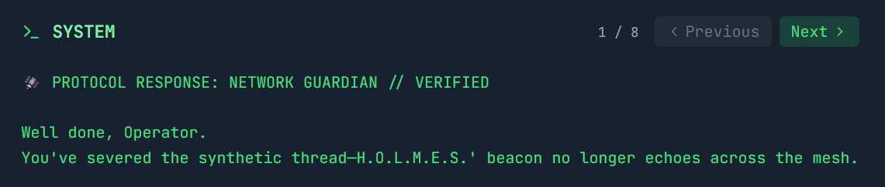

# Holmes CTF 2025 - The Payload

## Challenge Information

**Challenge Name:** The Payload  
**Difficulty:** Hard  
**Category:** Malware Analysis / Reverse Engineering  
**Event:** Holmes CTF 2025 - HackTheBox's First All-Blue CTF

## Description

With the malware extracted, Holmes inspects its logic. The strain spreads silently across all HPCs. Its goal? Not destruction—but something more persistent…

## Artifacts Provided

- `The_Payload.zip` containing:
  - `AetherDesk-v74-77.exe`
  - `AetherDesk-v74-77.pdb`

## ⚠️ CRITICAL SECURITY WARNING ⚠️

The downloaded artifacts should be considered **real malware**. This software has been intentionally included for educational purposes and is **NOT** intended to be executed or used otherwise. Always handle such files in isolated, controlled, and secure environments.

**Recommended precautions:**
1. Run the sample in a controlled environment (e.g., HTB Pwnbox or isolated VM - see [Setting Up a Safe Analysis Environment](#setting-up-a-safe-analysis-environment) section for more guidance)
2. Only analyze the software in this controlled environment
3. **EXERCISE EXTREME CAUTION**

---

## Table of Contents

- [Setting Up a Safe Analysis Environment](#setting-up-a-safe-analysis-environment)
- [Tools Used](#tools-used)
- [Walkthrough](#walkthrough)
  - [Question 1: COM Library DLL](#question-1-com-library-dll)
  - [Question 2: GUID for Object Instantiation](#question-2-guid-for-object-instantiation)
  - [Question 3: .NET Framework Feature](#question-3-net-framework-feature)
  - [Question 4: First Managed Code Call](#question-4-first-managed-code-call)
  - [Question 5: Key Generation Constants](#question-5-key-generation-constants)
  - [Question 6: Decryption Logic Call](#question-6-decryption-logic-call)
  - [Question 7: Killswitch Domain Resolution API](#question-7-killswitch-domain-resolution-api)
  - [Question 8: Network Share Enumeration API](#question-8-network-share-enumeration-api)
  - [Question 9: Payload Execution Opcode](#question-9-payload-execution-opcode)
  - [Question 10: Killswitch Domain and Final Flag](#question-10-killswitch-domain-and-final-flag)
- [Key Techniques Learned](#key-techniques-learned)
- [Complete Decryption Script](#complete-decryption-script)
- [Final Thoughts](#final-thoughts)
- [Answer Summary](#answer-summary)

---

## Setting Up a Safe Analysis Environment

Before analyzing malware, you need an isolated environment. Here's how I set mine up (note that I use windows 10):

### 1. Install VMware Workstation Player

1. Navigate to https://www.vmware.com/products/desktop-hypervisor/workstation-and-fusion
2. Click "DOWNLOAD NOW"
3. Sign up/login to Broadcom's authentication page
4. In "My Dashboard," navigate to "My Downloads", in "Free Software Downloads available HERE", click on "HERE"
5. Search for "vmware workstation"
6. Select "VMware Workstation Pro 17.0 for Windows"
7. Choose the latest version and download
8. Complete the registration form when prompted
9. Run the installer and follow the setup wizard

### 2. Enable Virtualization

1. Open Task Manager → Performance tab
2. Check if "Virtualization" is enabled
3. If disabled:
   - Restart computer
   - Press F2/F10/Del/Esc during boot (depends on manufacturer)
   - Find "Intel Virtualization Technology" or "VT-x"
   - Enable it
   - Save and exit BIOS

### 3. Download REMnux

REMnux is a Linux distribution specifically designed for malware analysis. It's fast, secure, and includes all necessary tools.

1. Visit https://docs.remnux.org/install-distro/get-virtual-appliance
2. Download the OVA file (~5 GB, takes approximately 1 hour depending on connection)

### 4. Import REMnux into VMware

1. Open VMware Workstation Player
2. Click "Open Virtual Machine"
3. Browse to the downloaded OVA file
4. Name it "REMnux" (or your preference)
5. Keep default storage path
6. Click "Import"

### 5. Configure VM Settings

Recommended specifications:
- **RAM:** Minimum 4 GB
- **CPU Cores:** 2 cores
- (Right-click VM → Settings to adjust)

### 6. Take a Snapshot

**Important:** Always take a snapshot before analysis so you can restore to a clean state.

1. Right-click the REMnux VM
2. Choose "Snapshot" → "Take Snapshot"
3. Name it "Fresh Install"
4. Description: "Clean REMnux before malware analysis"
5. Click "Take Snapshot"

### 7. Start REMnux

1. Click "Power On This Virtual Machine"
2. Wait for the terminal to appear
3. Type `ghidra` and press Enter (it's preinstalled)

**Note:** As long as the malware is zipped and not executed, it cannot cause harm. I transferred the ZIP file via USB, extracted it in the VM, and began analysis.

---

## Tools Used

- **Ghidra** - Free, powerful, beginner-friendly reverse engineering tool
- **Python 3** - For custom decryption scripts (I run the code on google colab)
- **REMnux** - Malware analysis Linux distribution

---

## Walkthrough

### Question 1: COM Library DLL

**Task:** During execution, the malware initializes the COM library on its main thread. Based on the imported functions, which DLL is responsible for providing this functionality?

**Solution:**

Opening the binary in Ghidra and navigating to the entry point (main function), I immediately noticed COM initialization calls in the disassembly.

Looking at the imported functions in the left panel, I could see references to:
- `CoInitialize`
- `CoCreateInstance`
- `OleRun`

All of these functions are imported from the same DLL.


**Flag:** `ole32.dll`

---

### Question 2: GUID for Object Instantiation

**Task:** Which GUID is used by the binary to instantiate the object containing the data and code for execution?

**Solution:**

In the decompiled C code (right panel in Ghidra), I found the `CoCreateInstance` call with the CLSID parameter. The GUID was clearly visible in the function call.


**Flag:** `dabcd999-1234-4567-89ab-1234567890ff`

---

### Question 3: .NET Framework Feature

**Task:** Which .NET framework feature is the attacker using to bridge calls between a managed .NET class and an unmanaged native binary?

**Solution:**

Based on the extensive use of COM APIs throughout the binary:
- `CoInitialize` - Initializes the COM library
- `CoCreateInstance` - Creates COM objects
- `OleRun` - Runs OLE objects
- Custom CLSID references to instantiate .NET objects

The malware uses **COM Interop** to bridge the gap between unmanaged native code (the binary) and managed .NET code. COM Interop is the .NET Framework's mechanism for allowing interoperability between COM and .NET objects.

**How it works:**
1. The native binary initializes COM
2. Creates a COM object using the custom GUID
3. Calls methods on this object through vtable offsets
4. The COM object wraps managed .NET code that performs the actual malicious operations

**Flag:** `COM Interop`

---

### Question 4: First Managed Code Call

**Task:** Which Opcode in the disassembly is responsible for calling the first function from the managed code?

**Solution:**

After analyzing the main function's disassembly, I tracked the program flow after COM object creation:

1. `CoCreateInstance` creates the object
2. `OleRun` initializes it
3. The first call to managed code happens through a vtable

At address `140001d23`, I found:

```assembly
140001d23 ff  50  68       CALL       qword ptr [RAX  + 0x68]
```

This calls through offset `0x68` in the COM object's vtable, which is the first invocation of managed code.


**Flag:** `FF 50 68`

---

### Question 5: Key Generation Constants

**Task:** Identify the multiplication and addition constants used by the binary's key generation algorithm for decryption.

**Solution:**

I located the key generation algorithm in the disassembly around address `140001dc1`:

Key operations identified:
```assembly
140001d86 MOVDQA XMM0, xmmword ptr [__xmm@0707070707...]  ; Load 0x07
140001d94 MOVDQA XMM1, xmmword ptr [__xmm@4242424242...]  ; Load 0x42
...
VPMULLW YMM1, YMM1, YMM0  ; Multiplication
PADDB   XMM3, XMM0         ; Addition
```

The algorithm follows this pattern:
```
key[i] = ((i * 7) + 0x42) & 0xFF
```

Where:
- **Multiplication constant:** 7
- **Addition constant:** 0x42 (hex)


**Flag:** `7, 42h`

---

### Question 6: Decryption Logic Call

**Task:** Which Opcode in the disassembly is responsible for calling the decryption logic from the managed code?

**Solution:**

After the key generation, the binary calls another method through the COM interface. At address `1400020f6`:

```assembly
1400020f6 ff  50  58       CALL       qword ptr [RAX  + 0x58]
```

This calls through offset `0x58` in the vtable, which invokes the managed decryption routine. The pattern is similar to the first call but uses a different offset for the decryption-specific method.


**Flag:** `FF 50 58`

---

### Question 7: Killswitch Domain Resolution API

**Task:** Which Win32 API is being utilized by the binary to resolve the killswitch domain name?

**Solution:**

After the decryption routine, I found network initialization code. The program flow:

1. `WSAStartup` - Initializes Winsock
2. Domain resolution attempt
3. Killswitch logic based on resolution result

At address `1400021fc`:

```assembly
1400021fc ff  15  16       CALL       qword ptr [->WS2_32.DLL::getaddrinfo]
```

The `getaddrinfo` API attempts to resolve the killswitch domain. If resolution **succeeds** (returns 0), the malware exits. If it **fails**, the malware continues execution.

This is a classic killswitch mechanism - the malware checks if a specific domain resolves, and only runs if it doesn't (indicating the researcher hasn't registered the domain yet).


**Flag:** `getaddrinfo`

---

### Question 8: Network Share Enumeration API

**Task:** Which network-related API does the binary use to gather details about each shared resource on a server?

**Solution:**

I analyzed the `ScanAndSpread` function, which handles the worm's propagation mechanism. At address `1400014d0`:

```assembly
1400014d0 ff  15  92       CALL       qword ptr [->NETAPI32.DLL::NetShareEnum]
```

`NetShareEnum` enumerates network shares on a target system. The function is called with:
- **Level 1** - Returns detailed share information
- Results stored in a buffer
- The code iterates through shares looking for open shares to exploit

This is classic SMB worm behavior (similar to WannaCry), scanning for network shares to spread laterally across the network.


**Flag:** `NetShareEnum`

---

### Question 9: Payload Execution Opcode

**Task:** Which Opcode is responsible for running the encrypted payload?

**Solution:**

After enumerating shares and preparing targets, the malware executes its payload. In the `ScanAndSpread` function at address `14000197a`:

```assembly
14000197a ff  50  60       CALL       qword ptr [RAX  + 0x60]
```

This is the third call through the COM interface, at offset `0x60`, which actually executes the malware payload on the target system. This comes after all the network share enumeration and target preparation.

The progression is clear:
- `0x68` - Initial setup/configuration
- `0x58` - Decryption
- `0x60` - **Payload execution**


**Flag:** `FF 50 60`

---

### Question 10: Killswitch Domain and Final Flag

**Task:** Find → Block → Flag: Identify the killswitch domain, spawn the Docker to block it, and claim the flag.

**Solution:**

This required multiple steps:

#### Step 1: Locate the Encrypted Domain

Earlier in the analysis, I found a Base64-encoded string at address `1400020c0`:

```assembly
1400020c0 LEA RCX, [s_KXgmYHMADxsV8uHiuPPB3w==]
```

#### Step 2: Decode Base64 to Hex

Using CyberChef:
```
KXgmYHMADxsV8uHiuPPB3w== → 29 78 26 60 73 00 0f 1b 15 f2 e1 e2 b8 f3 c1 df
```


#### Step 3: Generate the XOR Key

Based on Question 5's algorithm, I wrote a Python script:

```python
def generate_xor_key(length=32):
    key = []
    for i in range(length):
        key_byte = ((i * 7) + 0x42) & 0xFF
        key.append(key_byte)
    return key
```

#### Step 4: Decrypt the Domain

```python
encrypted_hex = [0x29, 0x78, 0x26, 0x60, 0x73, 0x00, 0x0f, 0x1b, 
                 0x15, 0xf2, 0xe1, 0xe2, 0xb8, 0xf3, 0xc1, 0xdf]

xor_key = generate_xor_key()

# XOR decryption
domain_bytes = [encrypted_hex[i] ^ xor_key[i] for i in range(len(encrypted_hex))]
domain = ''.join(chr(b) for b in domain_bytes)
```

**Step-by-step XOR operation:**

| Pos | Encrypted | XOR Key | Decrypted | ASCII |
|-----|-----------|---------|-----------|-------|
| 0   | 0x29      | 0x42    | 0x6b      | 'k'   |
| 1   | 0x78      | 0x49    | 0x31      | '1'   |
| 2   | 0x26      | 0x50    | 0x76      | 'v'   |
| 3   | 0x60      | 0x57    | 0x37      | '7'   |
| 4   | 0x73      | 0x5e    | 0x2d      | '-'   |
| ... | ...       | ...     | ...       | ...   |

**Killswitch domain:** `k1v7-echosim.net`


#### Step 5: Block the Domain and Retrieve Flag

1. Spawned the provided Docker container
2. Added `k1v7-echosim.net` to the DNS blacklist/hosts file
3. After blocking the domain, the CTF platform displayed a narrative dialogue before revealing the final flag:

<details>
<summary>Click to view the narrative sequence</summary>




</details>


**Flag:** `HTB{Eternal_Companions_Reunited_Again}`

---

## Key Techniques Learned

### COM Interop Architecture
- How malware uses COM to bridge native and managed code
- Vtable offset calling conventions
- GUID-based object instantiation

### Killswitch Mechanisms
- Domain-based killswitches (inspired by WannaCry analysis)
- How `getaddrinfo` is used as a killswitch trigger
- The logic: success = exit, failure = continue

### SMB Worm Behavior
- Network share enumeration via `NetShareEnum`
- Lateral movement techniques
- Classic worm propagation patterns

### Custom Encryption Algorithms
- Simple but effective XOR encryption
- Pattern: `key[i] = ((i * mult) + add) & 0xFF`

---

## Complete Decryption Script

Here's the full Python script I used:

```python
#!/usr/bin/env python3

def generate_xor_key(length=32):
    """Generate XOR key: key[i] = ((i * 7) + 0x42) & 0xFF"""
    key = []
    for i in range(length):
        key_byte = ((i * 7) + 0x42) & 0xFF
        key.append(key_byte)
    return key

def decrypt_domain(encrypted_hex, xor_key):
    """XOR decrypt the encrypted data"""
    decrypted = []
    for i, byte_val in enumerate(encrypted_hex):
        if i < len(xor_key):
            decrypted_byte = byte_val ^ xor_key[i]
            decrypted.append(decrypted_byte)
    return decrypted

def main():
    # Base64 decoded: KXgmYHMADxsV8uHiuPPB3w==
    encrypted_hex = [0x29, 0x78, 0x26, 0x60, 0x73, 0x00, 0x0f, 0x1b, 
                     0x15, 0xf2, 0xe1, 0xe2, 0xb8, 0xf3, 0xc1, 0xdf]
    
    print("Malware Killswitch Domain Decoder")
    print("=" * 50)
    
    xor_key = generate_xor_key()
    print(f"XOR key: {' '.join(f'{b:02x}' for b in xor_key[:16])}")
    
    decrypted_bytes = decrypt_domain(encrypted_hex, xor_key)
    domain = ''.join(chr(b) for b in decrypted_bytes)
    
    print(f"\nKillswitch domain: {domain}")
    
    # Detailed output
    print("\nStep-by-step XOR decryption:")
    print("Pos | Encrypted | XOR Key | Decrypted | ASCII")
    print("----|-----------|---------|-----------|------")
    
    for i, (enc, key) in enumerate(zip(encrypted_hex, xor_key)):
        dec = enc ^ key
        char = chr(dec) if 32 <= dec <= 126 else '?'
        print(f"{i:2d}  |   0x{enc:02x}    |  0x{key:02x}   |   0x{dec:02x}    |  '{char}'")

if __name__ == "__main__":
    main()
```

---

## Final Thoughts

This challenge was rated "Hard," but with proper methodology and tools, it was manageable. I'd rate it **Medium** personally, as the structure was logical and each step built naturally on the previous one.

**Key takeaways:**
1. Always analyze malware in isolated environments
2. COM Interop is a powerful technique for mixing native and managed code
3. Killswitches are simple but effective anti-analysis measures
4. Understanding calling conventions (vtable offsets) is crucial
5. Custom encryption often follows simple mathematical patterns

---

## Answer Summary

| Question | Answer |
|----------|--------|
| Q1 | `ole32.dll` |
| Q2 | `dabcd999-1234-4567-89ab-1234567890ff` |
| Q3 | `COM Interop` |
| Q4 | `FF 50 68` |
| Q5 | `7, 42h` |
| Q6 | `FF 50 58` |
| Q7 | `getaddrinfo` |
| Q8 | `NetShareEnum` |
| Q9 | `FF 50 60` |
| Q10 | `HTB{Eternal_Companions_Reunited_Again}` |

---
